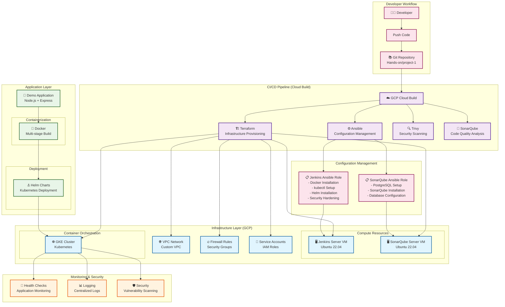

# DevOps Project Architecture Diagram

## 📋 Architecture Overview

### 🏗️ **Infrastructure as Code (Terraform)**
- **VPC Module**: Custom network with subnets and routing
- **VM Modules**: Jenkins and SonarQube server provisioning
- **Firewall Module**: Security rules and network policies
- **Service Account Module**: IAM roles and permissions
- **GKE Module**: Kubernetes cluster for application deployment

### ⚙️ **Configuration Management (Ansible)**
- **Jenkins Role**: Complete CI/CD server setup with Docker, kubectl, Helm
- **SonarQube Role**: Code quality server with PostgreSQL database
- **Playbooks**: Automated configuration deployment
- **Inventory**: Dynamic host management

### ☁️ **CI/CD Pipeline (Cloud Build)**
- **Multi-stage Pipeline**: Infrastructure → Configuration → Security → Deployment
- **Parallel Processing**: Concurrent security scanning and testing
- **Artifact Management**: Docker images and Helm charts
- **Integration Testing**: End-to-end validation

### 🐳 **Containerization & Orchestration**
- **Docker**: Multi-stage builds with security hardening
- **Kubernetes**: Container orchestration via GKE
- **Helm**: Application packaging and deployment
- **Health Checks**: Application monitoring and auto-healing

### 🔍 **Security & Quality**
- **Trivy**: Container and IaC vulnerability scanning
- **SonarQube**: Code quality analysis and technical debt tracking
- **Security Contexts**: Kubernetes pod security policies
- **Network Security**: VPC firewalls and service mesh

### 📊 **Monitoring & Observability**
- **Health Checks**: Application availability monitoring
- **Logging**: Centralized log aggregation
- **Metrics**: Performance and resource monitoring
- **Alerting**: Automated incident response

## 🔄 **Workflow Sequence**

1. **Development** → Developer pushes code to Git repository
2. **CI Trigger** → Cloud Build detects changes and starts pipeline
3. **Infrastructure** → Terraform provisions GCP resources
4. **Configuration** → Ansible configures servers (Jenkins & SonarQube)
5. **Security Scan** → Trivy scans for vulnerabilities
6. **Code Quality** → SonarQube analyzes code quality
7. **Build** → Docker creates application container
8. **Deploy** → Helm deploys to Kubernetes cluster
9. **Monitor** → Health checks and logging ensure stability

## 🛠️ **Technology Stack**

| Category | Technologies |
|----------|-------------|
| **IaC** | Terraform, HCL |
| **Configuration** | Ansible, YAML |
| **CI/CD** | Cloud Build, Jenkins |
| **Containerization** | Docker, Containerd |
| **Orchestration** | Kubernetes, Helm |
| **Security** | Trivy, SonarQube |
| **Cloud** | Google Cloud Platform |
| **Application** | Node.js, Express |
| **Database** | PostgreSQL |
| **Monitoring** | Health Checks, Logging |

## 🎯 **Key Features Demonstrated**

- ✅ **DevOps**: Complete automation from code to production
- ✅ **DevSecOps**: Security scanning integrated into pipeline
- ✅ **Cloud Engineering**: GCP services and best practices
- ✅ **Platform Engineering**: Kubernetes orchestration
- ✅ **Site Reliability**: Monitoring and reliability patterns
- ✅ **Infrastructure as Code**: Version-controlled infrastructure
- ✅ **GitOps**: Git-driven deployment workflows
