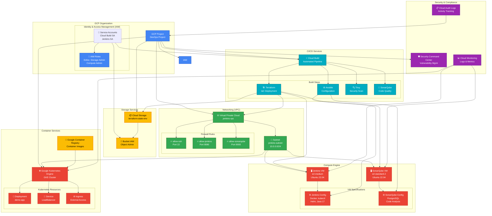

# GCP Architecture Diagram



## 🏗️ **GCP Architecture Overview**

### **Core GCP Services Used:**

#### 1. **🏗️ Compute Services**
- **Compute Engine**: Ubuntu VMs for Jenkins and SonarQube servers
- **Kubernetes Engine (GKE)**: Container orchestration for application deployment
- **Container Registry (GCR)**: Docker image storage and management

#### 2. **🌐 Networking Services**
- **Virtual Private Cloud (VPC)**: Isolated network environment
- **Subnets**: IP address management and regional deployment
- **Firewall Rules**: Security policies for VM access control

#### 3. **📦 Storage Services**
- **Cloud Storage**: Terraform state file storage with versioning
- **Bucket IAM**: Fine-grained access control for state files

#### 4. **🔐 Identity & Security**
- **Service Accounts**: Automated authentication for CI/CD
- **IAM Roles**: Least-privilege access management
- **Security Command Center**: Vulnerability assessment and compliance

#### 5. **⚡ CI/CD Services**
- **Cloud Build**: Fully managed CI/CD platform
- **Build Triggers**: Automated pipeline execution
- **Artifact Management**: Build artifacts and container images

#### 6. **📊 Monitoring & Observability**
- **Cloud Monitoring**: Infrastructure and application metrics
- **Cloud Logging**: Centralized log aggregation
- **Cloud Audit Logs**: Security and compliance auditing

### **🏛️ Infrastructure Architecture:**

```
GCP Project (DevOps Project)
├── 🏗️ Infrastructure Layer
│   ├── 🌐 VPC Network (jenkins-vpc)
│   │   ├── 📡 Subnet (10.0.0.0/24)
│   │   └── 🔥 Firewall Rules (SSH, Jenkins, SonarQube)
│   └── 📦 Cloud Storage (terraform-state-{env})
├── 🖥️ Compute Layer
│   ├── 🖥️ Jenkins VM (e2-medium)
│   │   ├── Docker, kubectl, Helm
│   │   └── Java 17, Jenkins
│   └── 🖥️ SonarQube VM (e2-standard-2)
│       ├── PostgreSQL Database
│       └── Code Analysis Engine
├── ☸️ Container Layer
│   ├── 🐳 Google Container Registry
│   └── ☸️ Google Kubernetes Engine
│       └── 🚀 Application Deployment
└── ⚡ CI/CD Layer
    └── ⚡ Cloud Build Pipeline
        ├── 🏗️ Terraform (IaC)
        ├── ⚙️ Ansible (Configuration)
        ├── 🔍 Trivy (Security)
        └── 🎯 SonarQube (Quality)
```

### **🔄 Service Dependencies:**

| Service | Dependencies | Purpose |
|---------|-------------|---------|
| **VPC** | Project | Network isolation |
| **Compute Engine** | VPC, Subnet, Firewall | VM hosting |
| **GKE** | VPC, Subnet | Container orchestration |
| **Cloud Storage** | Project, IAM | State management |
| **Cloud Build** | Service Account, IAM | CI/CD automation |
| **IAM** | Project | Access management |

### **🛡️ Security Implementation:**

- **Network Security**: VPC isolation, firewall rules, private subnets
- **Access Control**: Service accounts with minimal required permissions
- **Data Protection**: Encrypted storage, secure state management
- **Compliance**: Audit logging, security scanning integration

### **📈 Scalability Features:**

- **Regional Deployment**: Multi-zone availability
- **Auto-scaling**: GKE cluster scaling capabilities
- **Load Balancing**: Application traffic distribution
- **Resource Management**: Efficient VM sizing and cost optimization

This architecture demonstrates enterprise-grade GCP infrastructure implementation with proper security, scalability, and operational excellence practices! 🚀
